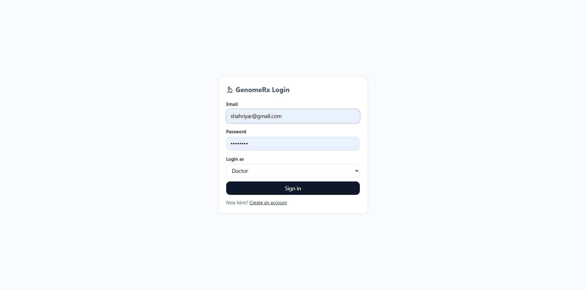
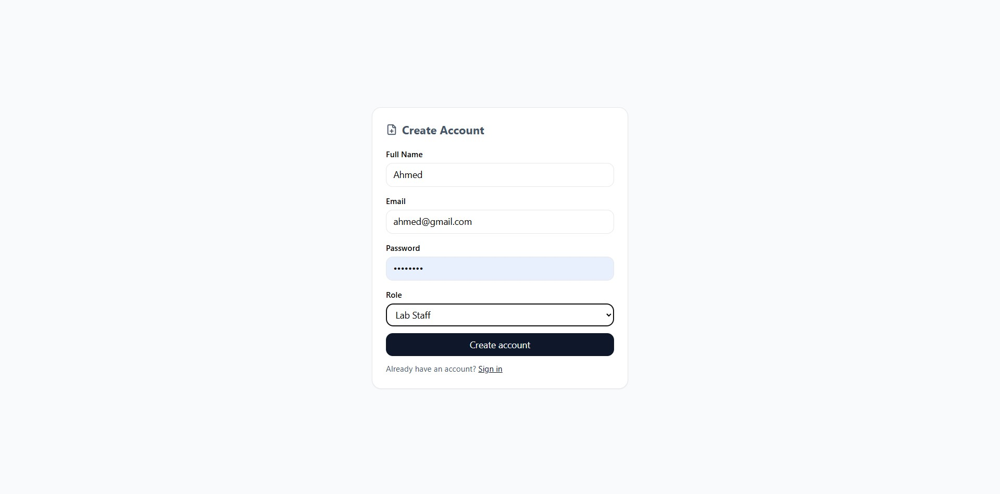
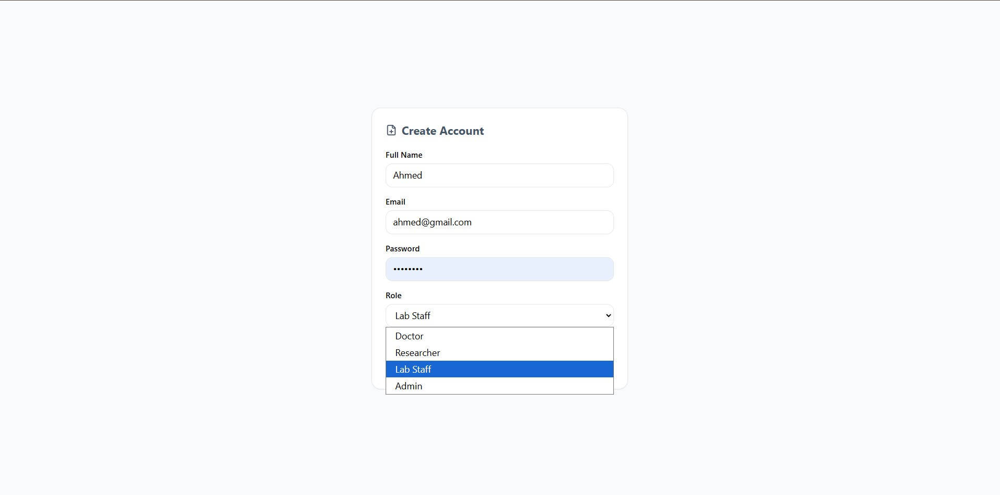
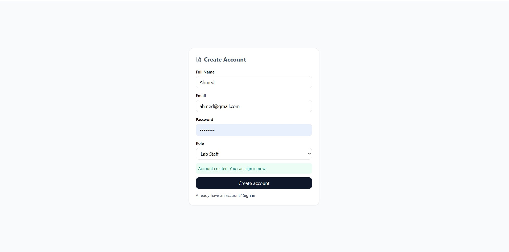

### 🔑 Authentication

#### Login Page


#### Create Account


#### Role Dropdown


#### Account Success

When you push this README to GitHub → it will render like this:

Section title ✅

Subtitle (Login Page, etc.) ✅

The actual screenshot image displayed below ✅

⚡ Do you want me to finalize and give you the rewritten README with every screenshot embedded (so you just copy-paste it as README.md and push)?


You said:
finalize and give ME the rewritten README with every screenshot embedded (so you just copy-paste it as README.md and push)?


ChatGPT said:
Perfect 🔥 I’ll finalize the complete README.md with every screenshot embedded so you can copy-paste it directly.

Here’s the ready-to-use README.md:

markdown
Copy code
# GenomeRx – Smart Genomic Insight for Antibiotic Selection

## 📌 Project Overview
**GenomeRx** is a smart genomic analysis platform designed to predict antimicrobial resistance (AMR) from genomic data and recommend effective antibiotics.  
It provides an interactive dashboard for doctors, researchers, and lab staff to upload genome sequences, run ML-powered AMR predictions, and generate clinical reports.

This system was developed as part of an academic software engineering project to showcase the integration of **machine learning**, **bioinformatics**, and **clinical decision support** in a secure and scalable application.

---

## 🚀 Key Features
- 🔐 **Role-based Authentication** – Admin, Doctor, Researcher, Lab Staff
- 📂 **Genome Upload** – Supports FASTA, CSV, PDF with validation
- 🤖 **AMR Prediction** – Uses **Random Forest** and **SVM** ML models with confidence scores
- 💊 **Top-3 Antibiotic Recommendations** – Based on prediction results
- 📊 **Visualization** – Confidence charts, resistance gene matches, history tracking
- 📝 **Clinical Reports** – Exportable to PDF with notes & tags
- 📜 **Task & Calendar Management** – Assign tasks, set deadlines, manage lab activities
- 💬 **Internal Chat** – Role-based direct messaging
- ⚙️ **Admin Tools** – User management, password reset, deactivate accounts
- 🌗 **Light/Dark Theme Support**

---

## 🛠️ Tech Stack
- **Frontend:** React (Vite, TailwindCSS, ShadCN/UI, Lucide Icons, Recharts, Framer Motion)  
- **Backend:** FastAPI (Python)  
- **Machine Learning:** Random Forest, SVM (scikit-learn)  
- **Database:** SQLite / MySQL  
- **UI Prototype:** Figma + custom design  
- **Version Control:** Git & GitHub  

---

## 📂 Project Structure
GenomeRx-Smart-Genomic-Insight/
│── backend/ # FastAPI backend code
│── frontend/ # React frontend app
│── genomerx-ui/ # UI prototype / alternate frontend
│── GenomeRX_DATA/ # Sample datasets (FASTA/CSV/PDF)
│── .gitignore
│── package-lock.json
│── INSTRUCTION FOR LOCAL SERVER.txt

yaml
Copy code

---

## ⚙️ Installation & Setup

### 1️⃣ Clone the Repository
```bash
git clone https://github.com/Shahriyarrrrr/GenomeRx-Smart-Genomic-Insight.git
cd GenomeRx-Smart-Genomic-Insight
2️⃣ Setup Backend (FastAPI)
bash
Copy code
cd backend
pip install -r requirements.txt
uvicorn main:app --reload
3️⃣ Setup Frontend (React)
bash
Copy code
cd frontend
npm install
npm run dev
4️⃣ Access Application
Open browser at: http://localhost:5173 (frontend)
Backend runs at: http://localhost:8000

📖 Usage Workflow
Login/Register with a role (Admin, Doctor, Researcher, Lab Staff).

Upload Genome file (FASTA/CSV/PDF).

Run AMR Prediction and review pathogen insights.

View Antibiotic Recommendations and resistance genes.

Generate PDF Report for clinical decision support.

Admin can manage users, reset passwords, assign tasks.

Researchers & Lab Staff can collaborate via tasks, calendar, and chat.

📸 Screenshots
🔑 Authentication
Login Page

Create Account

Role Dropdown

Account Success

📊 Dashboards
Admin Dashboard

Admin Dashboard (Dark Mode)

Doctor Dashboard

Lab Staff Dashboard

Researcher Dashboard

🧬 Genome Analysis
Upload Genome

File Dialog

Upload Progress

Prediction Results

Clinical Report

Notes & Tags

Print Report (PDF Export)

PDF Viewer Comparison

📂 History
Prediction History

Lab Staff Prediction History

📅 Task & Calendar
Tasks Page

New Task Modal

Calendar View

Edit Event

Doctor Tasks Page

Lab Staff Assigned Tasks

👨‍💻 Admin Tools
User Management

User Access Modal

💬 Chat
Direct Message

🤝 Contribution
Fork the repository

Create a new feature branch (git checkout -b feature-name)

Commit changes (git commit -m "Added new feature")

Push to branch (git push origin feature-name)

Open a Pull Request

📜 License
This project is developed for academic/demo purposes and is not intended for clinical use.
MIT License © 2025 GenomeRx Team

yaml
Copy code

---

✅ Steps for you now:  
1. Create a file named `README.md` in the root of your project.  
2. Paste the above content inside.  
3. Run:  
```bash
git add README.md
git commit -m "Add full professional README with embedded screenshots"
git push
